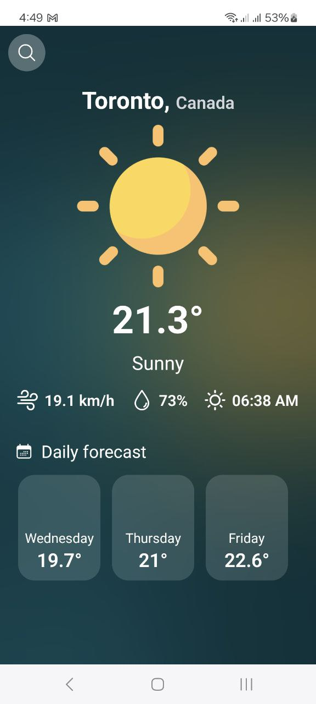
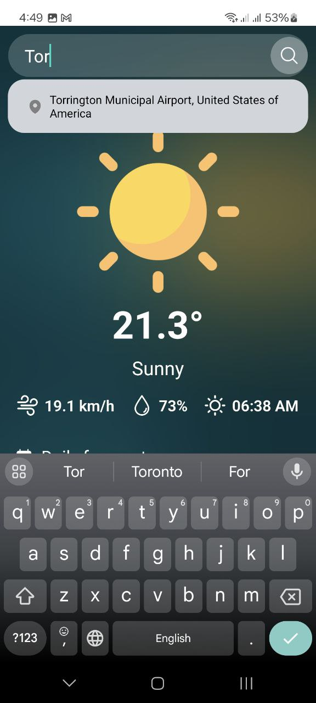
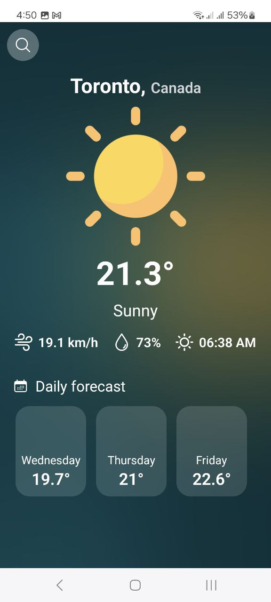

# `WeatherMan` React Native App

This is an Expo-managed React Native app for getting latest weather information in your desired area. the backend API
used in this project is [Weather API](https://www.weatherapi.com/).

## Contents

* [Demonstration](#demonstration)
    * [Videos](#videos)
    * [Screenshots](#screenshots)
* [Tech Stack](#tech-stack)
* [Contributors](#Contributors)

## Demonstration

### Videos

<b>Demo 1</b>

https://private-user-images.githubusercontent.com/8706521/362886049-70c679a4-b647-460a-b903-5d2369a6a12d.mp4?jwt=eyJhbGciOiJIUzI1NiIsInR5cCI6IkpXVCJ9.eyJpc3MiOiJnaXRodWIuY29tIiwiYXVkIjoicmF3LmdpdGh1YnVzZXJjb250ZW50LmNvbSIsImtleSI6ImtleTUiLCJleHAiOjE3MjQ5NjQ3MjEsIm5iZiI6MTcyNDk2NDQyMSwicGF0aCI6Ii84NzA2NTIxLzM2Mjg4NjA0OS03MGM2NzlhNC1iNjQ3LTQ2MGEtYjkwMy01ZDIzNjlhNmExMmQubXA0P1gtQW16LUFsZ29yaXRobT1BV1M0LUhNQUMtU0hBMjU2JlgtQW16LUNyZWRlbnRpYWw9QUtJQVZDT0RZTFNBNTNQUUs0WkElMkYyMDI0MDgyOSUyRnVzLWVhc3QtMSUyRnMzJTJGYXdzNF9yZXF1ZXN0JlgtQW16LURhdGU9MjAyNDA4MjlUMjA0NzAxWiZYLUFtei1FeHBpcmVzPTMwMCZYLUFtei1TaWduYXR1cmU9ZmZiODc3YTYwMDIxNGE0OTBlOTMzZWYwNGExYTZmNWE2NzA2Yzg2MjE2YmIyM2EwODg4ZDU5NzM1MDE0MzZlYiZYLUFtei1TaWduZWRIZWFkZXJzPWhvc3QmYWN0b3JfaWQ9MCZrZXlfaWQ9MCZyZXBvX2lkPTAifQ.hYudQ9PRp5WqcJsJTDDq_jlbPpVMgMhpYKfk_dv660E

### Screenshots

## Tech Stack

- [Expo](https://expo.dev/) - A set of tools and services built around React Native, allowing developers to build,
  deploy, and manage mobile apps for Android and iOS. It provides a layer of abstraction on top of React Native, making
  it easier to develop and maintain cross-platform apps.
- [TypeScript](https://www.typescriptlang.org/) - Superset of JavaScript programming language with syntax for types.
- [JSX](https://react.dev/learn/writing-markup-with-jsx) - A syntax extension for JavaScript that allows for HTML-like
  markup to be written inside a JavaScript/TypeScript file.
- [React Navigation](https://reactnavigation.org/) - A routing and navigation module for React Native apps.
- [Axios](https://axios-http.com/docs/intro) - A promise-based HTTP client for JavaScript.
- [AsyncStorage](https://react-native-async-storage.github.io/async-storage/) - An asynchronous, unencrypted,
  persistent, key-value storage solution for React Native applications.

## Contributors

Main developer: [Hojat Ghasemi](mailto:hojat72elect@gmail.com)
 

